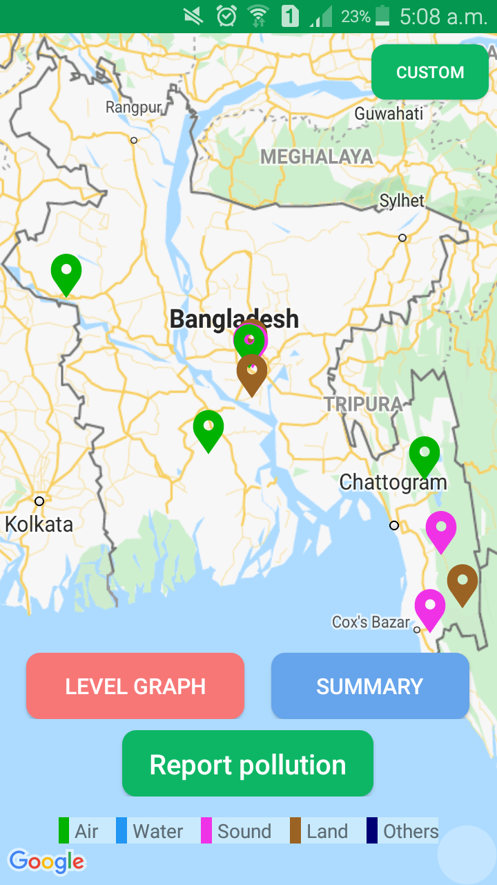

<h1 align="center">
-- WeFIX App --
</h1>

<!-- ## -- Screenshots -- -->

* ## ___Observe realtime pollution flags on map, tap on flags for details, view summary___

</ -->

* ## ___Search in specific locations, view summary reports and graphs___

* ## ___Submit pollution reports, pinpoint exact locations and upload multiple media files___

 

